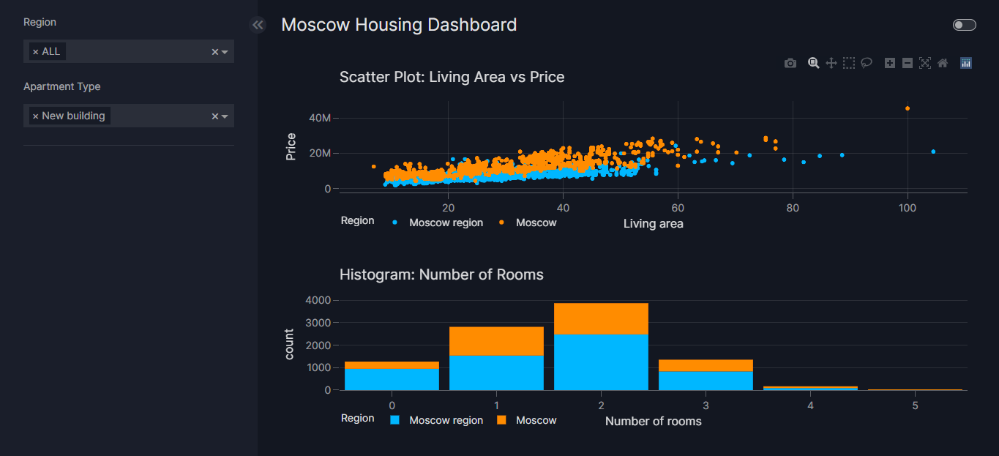

# Moscow Housing Price Prediction Project

## Overview

The Moscow Housing Price Prediction Project aims to develop a robust machine learning model for predicting housing prices in Moscow and the Moscow Oblast region. Leveraging a comprehensive dataset containing essential attributes such as location, size, amenities, and renovation level, the project endeavors to provide valuable insights into the dynamic real estate market in this area.

## Dataset

The dataset utilized for this project, collected in November 2023, encompasses crucial information essential for predicting housing costs. It includes the following columns:

- Price: Price of the apartment
- Apartment type: Type of apartment (e.g., studio, one-bedroom, etc.)
- Metro station: Nearest metro station
- Minutes to metro: Time in minutes to the nearest metro station
- Region: Region where the apartment is located (Moscow or Moscow Oblast)
- Number of rooms: Total number of rooms in the apartment
- Area: Total area of the apartment in square meters
- Living area: Living area of the apartment in square meters
- Kitchen area: Area of the kitchen in square meters
- Floor: Floor on which the apartment is located
- Number of floors: Total number of floors in the building
- Renovation: Level of renovation of the apartment

## Project Structure

The project adheres to a structured organization, facilitating ease of navigation and understanding. Key components include:

- **data/**: Directory housing dataset files and new datasets with interaction features.
- **model/**: Directory for saving and loading trained models.
- **dashboard.py**: Python script for creating a dashboard using Vizro to visualize scatter and histogram plots.
- **requirements.txt**: File containing the required dependencies for running the project.
- **README.md**: Comprehensive documentation providing an overview of the project, its structure, and usage instructions.

## Analysis Process

The project undertook a systematic analysis process, comprising the following steps:

1. **Data Exploration**: Comprehensive exploration of the dataset's structure, examination of summary statistics, and exploration of housing price distribution and other key attributes.
2. **Data Preprocessing**: Handling of categorical variables through one-hot encoding and splitting the dataset into training and testing sets.
3. **Initial Model Building**: Training of a Random Forest regression model on the original features and evaluation of its performance using mean squared error (MSE) and mean absolute error (MAE).
4. **Feature Engineering**: Creation of interaction features between relevant variables to capture potential nonlinear relationships or interactions.
5. **Hyperparameter Tuning**: Conducting grid search using cross-validation to identify the best hyperparameters for the Random Forest model.
6. **Model Optimization**: Saving the best-performing model for future use and validation.
7. **Model Evaluation**: Assessment of model performance using R-squared and visualizations for comparison of actual vs. predicted values.

## Latest Update

The project has undergone recent enhancements, including:

- Addition of interaction features between key variables to capture nuanced relationships.
- Refitting of the Random Forest model on updated training data and evaluation of its performance.
- Hyperparameter tuning using GridSearchCV to further optimize the model.
- Saving of the optimized model for future deployment and validation.

## How to Use

To utilize the project:

1. Install the required dependencies using `pip install -r requirements.txt`.
2. Run `dashboard.py` to visualize scatter and histogram plots using Vizro and open your browser on `localhost:8050`.
3. Access trained models from the `model/` directory for predictions.
4. Explore datasets in the `data/` directory for further analysis.

## Acknowledgments

- The project draws inspiration from the [Moscow Housing Price Dataset](https://www.kaggle.com/datasets/egorkainov/moscow-housing-price-dataset) available on Kaggle.
- Special thanks to [Vizro](https://vizro.readthedocs.io/en/stable/) for providing tools to create interactive dashboards for data visualization.

## Author

- **Mohammed Mebarek Mecheter**
- **Contact**: mohammedmecheter@gmail.com
- **LinkedIn**: [Mohammed Mebarek Mecheter](https://www.linkedin.com/in/mohammed-mebarek-mecheter/)

## Contributing

Contributions to the project are encouraged. For issues or suggestions, please open an issue or submit a pull request. Your feedback is valued and appreciated.